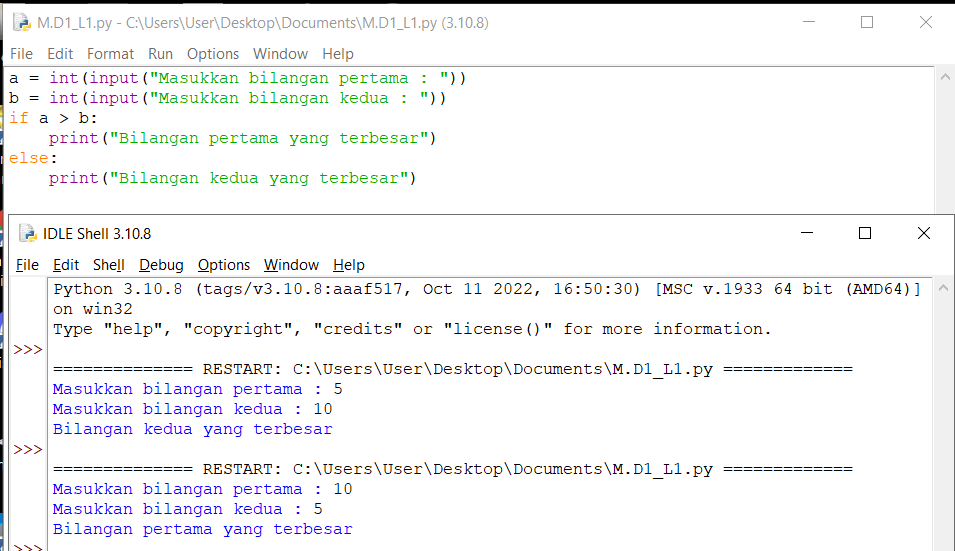
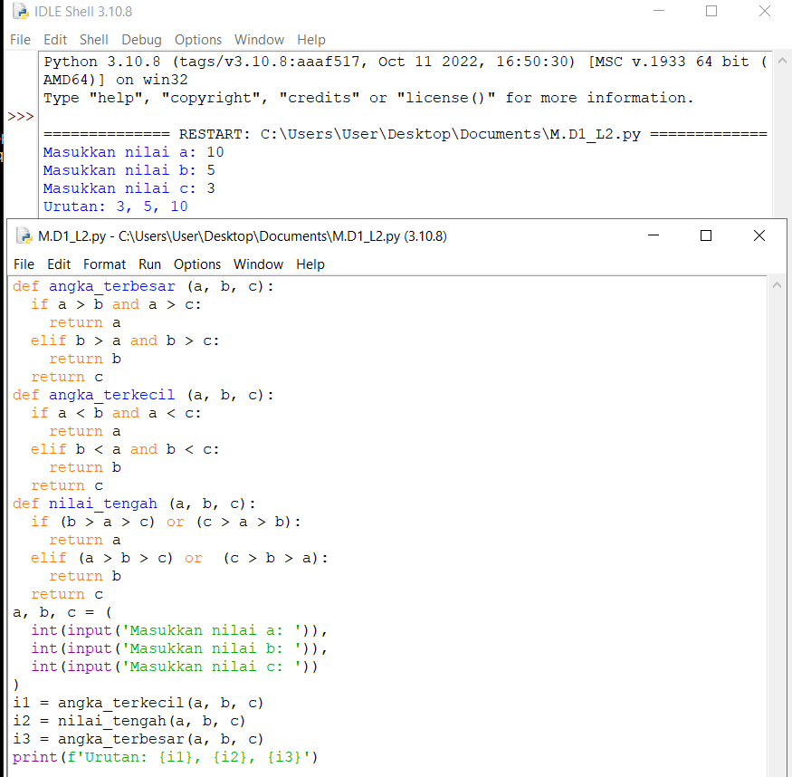
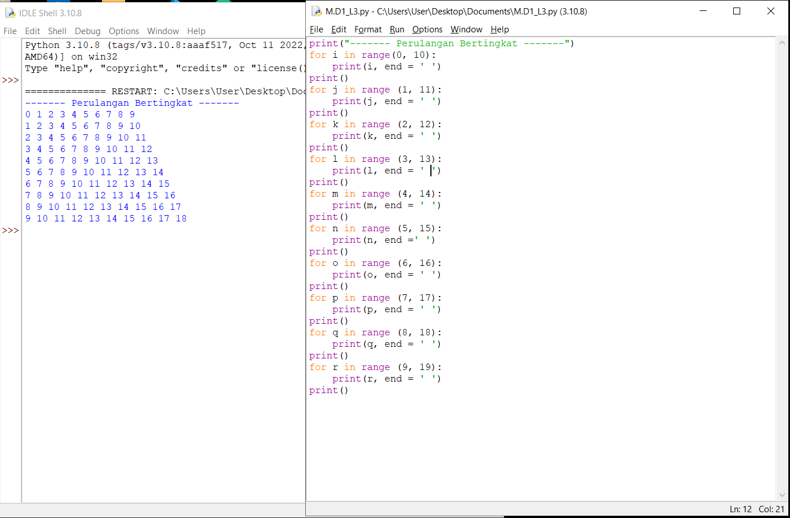
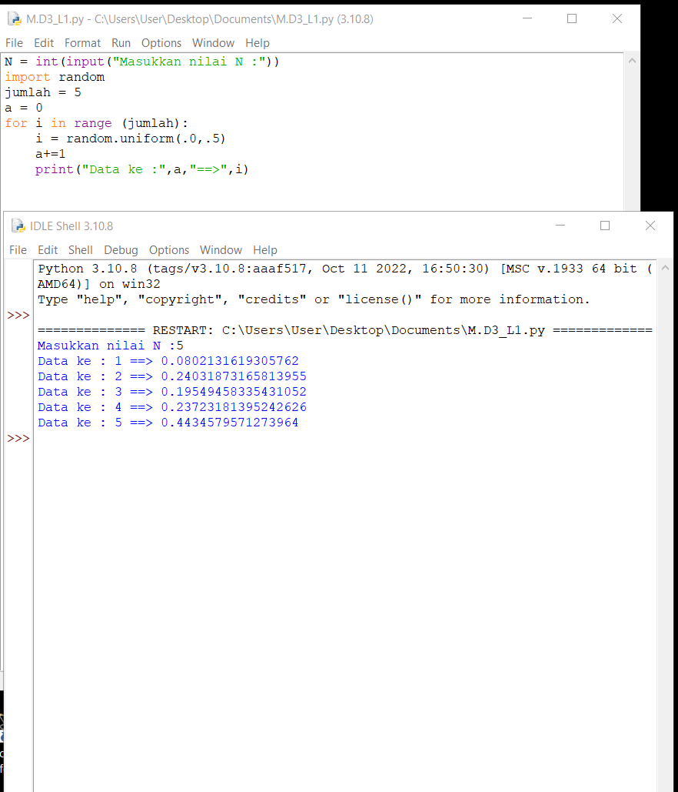

# Praktikum 4
# Lab 1 
## Tugas 1 
- Buat program sederhada dengan input 2 buah bilangan, kemudian tentukan bilangan terbesar dari kedua bilangan tersebut
menggunakan statement if.

## Tugas 2 
- Buat program untuk mengurutkan data berdasarkan input sejumlah data (minimal 3 variable input atau lebih), kemudian tampilkan hasilnya secara berurutan mulai dari data terkecil.

## Tugas 3
- Buat program dengan perulangan bertingkat (nested) for yang menghasilkan output sebagai berikut:

## Tugas 4
- Tampilkan n bilangan acak yang lebih kecil dari 0.5.
- Nilai n diisi pada saat runtime
- Anda bisa menggunakan kombinasi while dan for untuk menyelesaikannya

# Lab 2
## Tugas Praktikum 2
- Buat program sederhana dengan input tiga buah bilangan, dari ketiga bilangan tersebut tampilkan bilangan terbesarnya. Gunakan statement if.
![Gambar1](pk4/
- Menguraikan langkah-langkah dan algoritma dari menentukan 3 variabel yang berbeda dan urutkan nilai dari ketiga variabel tersebut dari yang terkecil
![Gambar1](pk4/
# Lab 3 
## Latihan1.py
![Gambar1}(pk4/
## Latihan2.py
![Gambar1](pk4/
## Pemograman1.py
![Gambar1](pk3/
